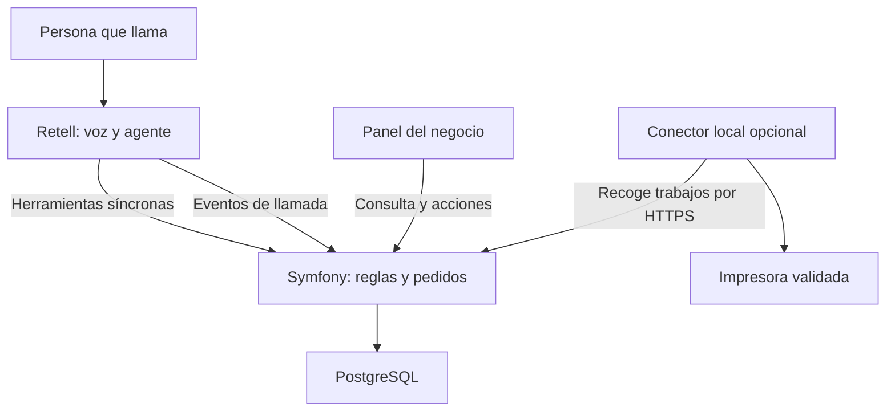

# Auto-order — Especificación del MVP

Versión: 0.1 · Fecha: 11 de septiembre de 2026

Estado: documentación para revisión y posterior implementación. No implica que exista código, repositorio, despliegue, número comprado o hardware validado.

## 1. Propósito y decisiones

Auto-order es una plataforma de atención telefónica con IA que convierte conversaciones en pedidos estructurados y los entrega al negocio mediante un panel y, opcionalmente, una impresora. Está dirigida a pequeños negocios con catálogo: restauración, panaderías, floristerías y otros comercios. No es exclusivamente para kebabs.

El MVP debe permitir enseñar el circuito completo: una persona llama, habla con el agente, confirma un pedido y el negocio lo ve aparecer. No necesita integrarse con todos los sistemas de los futuros clientes.

Decisiones explícitas del usuario:

- Proyecto independiente; `auto-order` es el nombre de trabajo, no una marca registrada ni un dominio comprobado.
- Tomar `autocaller` como referencia técnica, no modificar su funcionamiento.
- Retell AI es la integración de voz del MVP. No desarrollar una integración directa con Twilio.
- Primero documentación; después se creará el repositorio y se implementará.
- Cada instalación comercial se estudiará según telefonía, impresoras y software del negocio.
- El dominio y el panel deben ser genéricos, aunque la demostración incluya un kebab.

Las decisiones de detalle siguientes son propuestas de implementación por defecto. Pueden revisarse sin cambiar el objetivo.

## 2. Alcance y límites

### Incluido

- Symfony con controladores, entidades, repositorios y servicios convencionales.
- Varios negocios aislados en una aplicación; una ubicación por negocio en el MVP.
- Catálogo por negocio: categorías, productos, variantes, grupos de opciones y suplementos.
- Productos vendidos por unidades enteras. Moneda EUR e interfaz/agente en español inicialmente.
- Configuración de horarios, pausa de pedidos, recogida y entrega local.
- Una configuración de agente entrante por negocio; asociación del número en Retell hecha manualmente.
- Recepción de llamadas, herramientas síncronas para consultar/validar/confirmar pedidos y webhooks de seguimiento.
- Panel de pedidos actualizado automáticamente, historial y acciones del operador.
- Dos negocios ficticios, uno de restauración y otro de comercio no alimentario.
- Ticket imprimible con vista previa. Conector físico opcional para un único modelo y entorno validados.
- Pruebas automatizadas sin llamadas reales, guía de despliegue y guion de demo.

### Fuera de alcance

- CRM/Odoo, importación de leads y llamadas comerciales salientes.
- Integraciones reales con TPV/ERP, portabilidades o automatización de operadoras.
- Compatibilidad universal de impresoras, instalación remota masiva o aplicaciones móviles nativas.
- Cobro por teléfono, tarjetas, pasarelas de pago, facturación o sustitución de la caja del comercio.
- SMS/WhatsApp de confirmación, transferencias humanas y devolución automática de llamadas.
- Citas, reservas de mesas, presupuestos abiertos, servicios regulados o venta de artículos restringidos.
- Inventario numérico, reparto optimizado, geocodificación, franjas futuras y productos vendidos por peso.
- Suscripciones SaaS, autorregistro de clientes y portal público para comprar online.
- Constructor universal de flujos por sector, marketplace de plugins o microservicios.

Genérico significa reutilizar catálogo, pedido y entrega entre comercios compatibles. No significa resolver cualquier proceso comercial.

## 3. Definición de éxito

Una demostración debe mostrar, sin intervenir en la base de datos:

1. Llamada real a un número de prueba atendida por Retell.
2. Identificación del negocio correcto y consulta de su catálogo.
3. Selección de artículos, cantidades y opciones; al menos una corrección del interlocutor.
4. Cálculo del importe por Symfony, no por el modelo.
5. Lectura del resumen y confirmación verbal explícita.
6. Creación de un único pedido persistido y aparición en el panel.
7. Cambio de estado por el operador y vista previa del ticket.
8. Si se habilita hardware, salida física verificable del ticket.

Objetivos medidos en el entorno de demo: herramientas habituales con p95 inferior a 2 segundos, excluyendo servicios externos; aparición en panel en menos de 5 segundos desde el commit. Son objetivos, no resultados ya obtenidos ni un SLA comercial.

El modo simulado debe estar etiquetado como tal. No sustituye la aceptación final mediante llamada real. La impresión física es un hito opcional y separado: sin ella no se afirmará que el hardware está validado.

## 4. Usuarios y pantallas

| Actor | Permisos |
| --- | --- |
| Administrador de plataforma | Crear negocios, usuarios, asociaciones telefónicas, configuración y revisar incidencias |
| Operador de negocio | Ver sus pedidos y llamadas, avanzar estados, pausar recepción, marcar productos agotados y reimprimir |
| Persona que llama | Realizar un pedido sin registrarse; no tiene acceso al panel |
| Dispositivo de impresión | Leer y confirmar exclusivamente sus trabajos, mediante credencial propia |

Propuesta: usuarios locales creados por administrador, sin registro público. Un operador puede tener varias membresías, pero cada petición queda limitada al negocio seleccionado y autorizado.

Pantallas:

- **Pedidos:** tarjetas nuevas, en preparación, listas y cerradas; referencia, hora, modalidad, importe y aviso de incidencias.
- **Detalle:** artículos y opciones explícitas, contacto mínimo, dirección si procede, llamada vinculada, historial y estado de impresión independiente.
- **Catálogo:** CRUD de productos, variantes y opciones; activar/desactivar sin borrar históricos.
- **Negocio:** datos comerciales, horario, zona horaria, modos admitidos, tiempo orientativo, entrega y pausa.
- **Telefonía:** identificadores y asociación local; indicador de configuración verificada manualmente. No presentar un simple campo guardado como sincronización efectiva con Retell.
- **Llamadas:** actividad y resultado técnico, incluido “sin pedido”.
- **Impresión:** vista previa, trabajos, fallos y reimpresión autorizada.
- **Demo:** cargar datos ficticios, simular eventos y mostrar claramente el entorno.

Diseño tablet-first, usable en móvil y escritorio. Controles grandes, sin depender solo del color. Sonido tras pulsar “Activar avisos” por las restricciones del navegador; indicador visible si los avisos no están activados o el panel pierde conexión.

## 5. Catálogo genérico y reglas de negocio

Cada negocio define un catálogo propio. No deben existir entidades como Kebab, Salsa o Pizza: son registros configurables.

| Concepto | Restauración | Floristería |
| --- | --- | --- |
| Producto | Durum | Ramo de temporada |
| Variante | Normal / grande | Estándar / grande |
| Grupo de opciones | Carne, salsa | Envoltorio, tarjeta |
| Suplemento | Extra queso | Jarrón |
| Nota libre | Cortado por la mitad | Texto de dedicatoria |
| Cumplimiento | Recogida / entrega | Recogida / entrega |

Reglas:

- Cada producto tiene al menos una variante vendible; una variante por línea.
- Grupos con mínimo/máximo de elecciones y opciones permitidas. Selección única por opción en el MVP.
- Alias ayudan a buscar, pero una coincidencia ambigua exige preguntar.
- Las cantidades son enteros positivos con máximos configurados; límite inicial propuesto de 20 unidades por línea y 30 líneas por pedido.
- Importes en céntimos enteros. Precio unitario = variante + suplementos seleccionados; total = suma de líneas + entrega.
- El servidor ignora cualquier precio enviado por el modelo y rechaza combinaciones ajenas al producto/negocio.
- Notas libres limitadas a 500 caracteres, tratadas como datos; nunca alteran precio, disponibilidad ni permisos.
- Un agotado no se puede confirmar. No se promete stock numérico al no haber integración de inventario.
- Los pedidos conservan copias de nombres, opciones y precios; cambios posteriores del catálogo no cambian pedidos ya confirmados.
- Recogida: nombre y teléfono de contacto confirmado. Entrega: además calle, número, localidad, código postal y aclaraciones necesarias.
- No asumir que el caller ID es correcto ni utilizarlo como autenticación de un cliente.
- Entrega del MVP por lista de códigos postales admitidos y coste fijo por negocio. Si la dirección no se puede validar suficientemente, no prometer cobertura.
- Pedido mínimo de entrega aplicado al subtotal de productos, antes del cargo de reparto.
- Horario semanal en zona del negocio, incluyendo intervalos que cruzan medianoche; pausa manual prevalece sobre horario.
- Tiempo de preparación es una estimación configurada por el local, no una promesa calculada por IA.
- Para consultas alimentarias, usar solo información confirmada por el negocio; no inferir ausencia de alérgenos o contaminación cruzada. Una condición que requiera validación humana impide autoaceptación.

## 6. Conversación y aceptación

Secuencia prevista:

1. Identificarse como asistente virtual del negocio y consultar si admite pedidos.
2. Preguntar recogida o entrega y obtener lo necesario para validar esa modalidad.
3. Consultar catálogo, resolver variantes/opciones obligatorias y recoger cantidades.
4. Validar y cotizar el borrador en Symfony.
5. Leer artículos, modificaciones, modalidad, datos relevantes y total devueltos por la API.
6. Si el cliente cambia algo, cotizar otra vez; nunca confirmar una versión antigua.
7. Tras un “sí” explícito al resumen actual, ejecutar confirmación.
8. Comunicar únicamente el resultado que haya devuelto el backend, incluida referencia.

El agente no debe decir “he creado el pedido” antes de que el servidor lo confirme. Si hay un timeout, consulta el resultado antes de reintentar. El análisis posterior de la llamada no es el mecanismo de creación del pedido.

### Dos políticas explícitas

- **Automática, valor propuesto para la demo:** si todas las validaciones pasan, el pedido queda ACCEPTED. El local ha autorizado previamente esa política. La frase final indica que está registrado/aceptado y ofrece la estimación configurada, sin afirmar que ya se imprimió.
- **Manual:** se guarda como SUBMITTED y se indica “recibido, pendiente de aceptación por el negocio”. No se promete un SMS/WhatsApp inexistente. El panel permite aceptar/rechazar; en una instalación real debe definirse cómo se informa al cliente después. Esta política sirve para mostrar supervisión, pero no es el guion principal de la demo.

La aceptación comercial, la confirmación verbal y la impresión son hechos distintos. Una impresora no decide si el negocio acepta un pedido.

MVP: máximo un pedido por llamada. Se permiten cambios antes de confirmarlo. Si el cliente quiere cambiar/cancelar después, el agente no crea otro: registra una incidencia para el operador. Cambios posteriores automáticos quedan fuera de alcance.

## 7. Arquitectura propuesta

Monolito Symfony, Doctrine y PostgreSQL; Twig y JavaScript ligero para el panel. Seleccionar versiones soportadas y compatibles al arrancar el repositorio y fijarlas en dependencias. No se requiere Redis, Kafka, WebSocket de audio ni Twilio SDK.



Symfony es la fuente de verdad de catálogo, cotizaciones, pedidos y entrega al local. Retell gestiona conversación y telefonía. El panel consulta la base de datos a través de Symfony, no recibe los pedidos de Retell directamente.

Actualización del panel mediante polling incremental cada 2 segundos mientras esté visible, con cursor, paginación y reconexión. Evitar infraestructura adicional para esta escala.

La creación del pedido y del trabajo de impresión pendiente se realiza en una transacción. Los efectos físicos son asíncronos; nunca mantener abierta una herramienta de voz esperando una impresora.

Servicios orientativos: CatalogService, QuoteService, OrderConfirmationService, BusinessResolver, RetellWebhookHandler, CallReconciler, PrintJobService y AuditService. Interfaces solo para fronteras reales, como transporte Retell e impresión; no construir todavía un sistema de plugins de TPV.

### Qué reutilizar de autocaller

Revisar el código actual al iniciar la implementación: gestión multempresa, credenciales cifradas, autenticación, cliente HTTP y patrones de webhook/idempotencia. Los archivos revisados en esta conversación son referencia, no prueba del despliegue actual.

No copiar la dependencia de Odoo, Lead, CallAttempt ni la cola de llamadas salientes. No heredar supuestos telefónicos antiguos de su README. No compartir base de datos ni credenciales por defecto. Revalidar la firma con la documentación y fixtures actuales de Retell.

## 8. Modelo de datos

| Entidad | Campos/relaciones principales |
| --- | --- |
| Business | UUID, nombre, sector descriptivo, zona horaria, moneda, horario, pausa, modos, política de aceptación, datos de contacto |
| User / BusinessMembership | Usuario, hash de contraseña, negocio y rol |
| PhoneLine | Negocio, número E.164, referencia de cuenta Retell, agent_id esperado, activa, fecha de verificación |
| Category | Negocio, nombre, orden |
| Product | Negocio, categoría, nombre, descripción, alias, activo |
| ProductVariant | Producto, nombre, precio en céntimos, disponible |
| OptionGroup / ProductOptionGroup | Grupo, vínculo con producto, límites mínimo/máximo |
| ProductOption | Grupo, nombre, suplemento, disponible |
| Call | Negocio nullable hasta resolver, provider_call_id único por cuenta, dirección, origen/destino nullable, agente, estado y tiempos |
| OrderQuote | Negocio, llamada, versión, snapshot normalizado, total, vencimiento, estado de consumo |
| Order | Negocio, llamada, referencia, estado, modalidad, contacto/dirección snapshot, moneda, totales, fechas y política aplicada |
| OrderItem | Pedido, referencias a producto/variante, nombres/precios snapshot, opciones snapshot, cantidad y nota |
| OrderEvent | Pedido, transición, actor, motivo, fecha |
| WebhookReceipt | Cuenta, identificador/clave del evento, tipo, hash, recepción y procesamiento |
| PrinterDevice | Negocio, alias, transporte/perfil, credencial cifrada o hash según uso, heartbeat |
| PrintJob | Pedido, dispositivo, snapshot del ticket, estado, intentos, lease, error y referencia de reimpresión |
| AuditEvent | Negocio, actor, acción, entidad y cambios no sensibles |

No crear todavía un CRM: los datos de contacto/dirección viven en el pedido. Evitar agrupar personas por teléfono como si fuera identidad verificada.

Restricciones de base de datos: número activo no asignado a dos negocios en una misma cuenta; referencia de pedido única por negocio; máximo un pedido por llamada; cotización consumida una vez; trabajo automático único por pedido/dispositivo. Relaciones y consultas siempre limitadas al tenant.

Estados de pedido:

- SUBMITTED → ACCEPTED o REJECTED.
- ACCEPTED → PREPARING o CANCELLED.
- PREPARING → READY o CANCELLED.
- READY → COMPLETED o CANCELLED.
- REJECTED, CANCELLED y COMPLETED son terminales.

Confirmación automática entra directamente en ACCEPTED con evento de auditoría. Cancelar requiere motivo. No hay edición silenciosa de un pedido confirmado.

Estados de llamada y de pedido no se acoplan: colgar no cancela un pedido aceptado. Una llamada puede terminar sin ningún pedido.

## 9. Contratos internos y herramientas Retell

Los nombres y rutas siguientes son contratos de Auto-order propuestos; no son endpoints oficiales de Retell. El adaptador traducirá el formato real de custom functions a DTO internos.

| Herramienta / endpoint POST | Entrada de negocio | Resultado |
| --- | --- | --- |
| get_business_context /api/voice/context | Contexto de llamada autenticado | Nombre, horario, pausa, modos, política y estimación |
| search_catalog /api/voice/catalog/search | query, category_id opcional | Productos permitidos, IDs, variantes y opciones |
| quote_order /api/voice/orders/quote | items, fulfillment, contact, address si aplica | quote_id, versión, caducidad, resumen, total y errores |
| confirm_order /api/voice/orders/confirm | quote_id, customer_confirmed=true | Referencia, estado comercial y mensaje fiable |
| get_current_order /api/voice/orders/current | Contexto de llamada autenticado | Resultado ya persistido o ausencia de pedido |

Contexto: call_id y agent_id obtenidos del sobre del proveedor, con autenticación de la petición; no de argumentos libres del modelo. Vincularlos a PhoneLine/negocio conocido. Un token por integración puede añadir defensa y delimitar el tenant; no aceptar un business_id arbitrario para elegirlo. Si aún no llegó el webhook de inicio, verificar/resolver la llamada con el proveedor antes de autorizar una escritura; si no puede verificarse, fallar cerrado.

Formato interno orientativo de cotización:

```json
{
  "items": [
    {"variant_id": "<uuid>", "quantity": 2, "option_ids": ["<uuid>"], "note": ""}
  ],
  "fulfillment": "pickup",
  "contact": {"name": "Cliente Demo", "phone": "+<numero_de_prueba>"}
}
```

El ejemplo es ilustrativo: los marcadores no son datos válidos para ejecutar una llamada.

La cotización se guarda durante 5 minutos, ligada a negocio y llamada. Una nueva cotización invalida la anterior. Confirmar exige la última cotización, no caducada, y revalidación de horario, pausa, disponibilidad y precios. Si algo cambió, devolver QUOTE_CHANGED/EXPIRED y pedir nueva confirmación tras volver a leer el resumen.

`customer_confirmed` documenta la afirmación del agente; no es una prueba independiente de consentimiento. Su uso correcto se valida con pruebas conversacionales y revisión de la demo.

Dentro de una transacción: bloquear cotización/llamada, comprobar pedido existente, crear pedido y trabajo si corresponde, marcar cotización consumida y confirmar. Repetir confirm_order devuelve el mismo pedido. Otra cotización para una llamada ya confirmada devuelve ORDER_ALREADY_CONFIRMED, no crea un segundo pedido.

Errores funcionales normalizados: CLOSED, PAUSED, PRODUCT_UNAVAILABLE, INVALID_OPTIONS, DELIVERY_UNSUPPORTED, MINIMUM_NOT_MET, QUOTE_EXPIRED, QUOTE_CHANGED y ORDER_ALREADY_CONFIRMED. Propuesta de respuestas: HTTP 200 con `ok:false` para errores conversacionales; 401/403 para autenticación/autorización, 422 para esquema inválido, 429 para límite y 5xx para error técnico. No revelar trazas.

La persistencia del pedido no debe depender del orden de webhooks ni de recibir call_analyzed.

## 10. Telefonía y eventos

En Retell se asocia manualmente el agente entrante al número de prueba. En Auto-order se registra la asociación esperada número/cuenta/agente/negocio. Dos negocios de prueba requieren asociaciones distinguibles; pueden demostrarse secuencialmente con un solo número, cambiando su asociación de forma controlada y sin llamadas activas.

### Corrección respecto a la conversación preliminar

No asumir que comprar un número en Retell proporciona un +34. La documentación consultada el 11/09/2026 indica compra directa de números de EE. UU. y Canadá. El número real disponible, coste de llamar desde España y capacidad entrante se verifican en la cuenta antes de la demo. No contratar nada automáticamente. [Fuente: compra de números](https://docs.retellai.com/deploy/purchase-number).

La asignación de un agente habilita la recepción en un número Retell o importado. [Fuente: llamadas entrantes](https://docs.retellai.com/deploy/inbound-call).

Conservar un número comercial existente será trabajo de instalación: estudiar desvío, centralita/SIP o portabilidad admitida por proveedor. No se garantiza desvío internacional, precio incluido, preservación de caller ID ni concurrencia. No confundir un número verificado para mostrarlo como emisor con una línea que recibe llamadas. Twilio no es una dependencia de este MVP.

### Webhook de seguimiento

POST /api/webhooks/retell: verificar autenticidad sobre cuerpo crudo antes de procesar. Recibir call_started, call_ended y call_analyzed; registrar recibo de forma duradera y aplicar efectos idempotentes. El procesamiento en error debe poder reintentarse sin quedar marcado como exitoso.

Resolver negocio por asociación confiable de número/agente/cuenta; nunca por el teléfono del cliente. Evento desconocido: conservar mínimo técnico y señalar “sin asignar”; no atribuir al negocio por defecto.

Upsert de Call aunque llegue primero el final. No retroceder de finalizada a activa. Eventos repetidos no duplican pedidos ni efectos. Elegir clave según los identificadores disponibles en el payload actual; si se admiten revisiones de análisis, versionarlas en lugar de descartarlas todas por compartir call_id.

Configurar un reconciliador para consultar llamadas conocidas que queden sin estado terminal. Esta consulta no crea pedidos. Detalles, firma y fixtures deben contrastarse con [seguridad de webhooks](https://docs.retellai.com/features/secure-webhook).

Las custom functions permiten consultar/escribir en nuestra API durante la conversación; ese es el canal para confirmar un pedido. [Fuente: custom functions](https://docs.retellai.com/build/single-multi-prompt/custom-function).

Apagar `accept_orders` en Symfony impide confirmar pedidos, pero no garantiza que Retell deje de contestar ni de generar coste. La desactivación telefónica y los límites/concurrencia del proveedor se revisan aparte. Evitar transferir una llamada al mismo número que vuelve a desviarla al agente.

## 11. Impresión y entrega al local

### Base obligatoria sin hardware

Generar ticket HTML con referencia, negocio, fecha, estado, modalidad, artículos/opciones, importes, contacto y dirección cuando corresponda. Marcar DEMO en fixtures. Vista previa y botón de impresión mediante el navegador, sin prometer impresión silenciosa.

El ticket es una comanda/pedido, no reemplaza el registro de venta o comprobante del TPV. Sin integración, el negocio sigue gestionando cobro y caja en su sistema habitual.

### Extensión física acotada

Un servicio local en el equipo de demostración consulta por HTTPS los trabajos de un dispositivo autorizado y los envía a una impresora concreta con controlador o protocolo validado. No exponer la impresora ni abrir puertos del router a Internet. Sistema operativo, conexión y modelo pendientes de elección; no asumir compatibilidad por llamarse ESC/POS.

API propuesta: POST /api/print/jobs/claim, POST /api/print/jobs/{id}/result y POST /api/print/heartbeat. El dispositivo no elige otro tenant. Lease de 60 segundos renovable para evitar dos workers sobre el mismo trabajo.

Estados: QUEUED, CLAIMED, SENT_TO_DEVICE, PRINT_CONFIRMED, UNKNOWN y FAILED. Registrar el nivel de evidencia disponible. La aceptación por el spooler no prueba que el papel haya salido.

Reintentar automáticamente solo fallos anteriores a un envío conocido. Si hubo envío y se perdió la respuesta, marcar UNKNOWN y pedir revisión; no reimprimir a ciegas. La entrega exactamente una vez al papel no se puede garantizar con hardware sin acuse persistente.

Reimpresión manual crea otro trabajo con actor/motivo y marca COPIA. Para aceptación automática, encolar al confirmar; para manual, encolar al aceptar. Una cancelación de pedido impreso genera aviso visible al operador; no borra ni retira papel.

Heartbeat ausente, papel agotado cuando sea detectable y errores se muestran en panel. El pedido se conserva aunque falle la impresora. Alertar de pedidos sin atender; la demo no depende exclusivamente del papel.

## 12. Seguridad, operación y límites

- HTTPS, login con contraseñas hasheadas, cookies seguras y CSRF en panel.
- Aislamiento tenant en lectura, mutación, búsqueda, llamadas, cotizaciones, dispositivos y exportaciones; tests negativos obligatorios.
- Secretos fuera de Git; variables de despliegue o cifrado con clave externa. No incluir claves en fixtures, logs ni frontend.
- Autenticación de todas las herramientas, no solo del webhook. Firma y controles según contrato actual del proveedor.
- Rate limit, tamaños máximos de peticiones y allowlist de acciones. La salida del modelo se valida como entrada no confiable.
- Logs con IDs y teléfonos enmascarados; no volcar payloads/transcripciones por defecto.
- Grabaciones y transcripciones desactivadas donde sea configurable para la demo; revisar también retención en Retell, no solo en Symfony.
- Datos exclusivamente ficticios o de participantes informados en demostraciones. Propuesta de purga: datos personales de demo a los 7 días; validar política antes de usuarios reales.
- Historial de acciones y fallos de impresión. Backups cifrados y ensayo de restauración antes de un piloto.
- Relojes en UTC en persistencia y presentación en zona del negocio.
- Métricas: llamadas, llamadas sin pedido, pedidos confirmados, errores de herramientas, duplicados evitados, latencia, trabajos fallidos/desconocidos y coste disponible del proveedor. Sin precios inventados ni estimación comercial aún.

Antes de un piloto real, revisar privacidad, tratamiento de datos, avisos al llamante, contratos con proveedores y reglas comerciales aplicables. Este documento es una especificación técnica, no una evaluación jurídica.

## 13. Datos de demostración

Dos negocios aislados, sin IDs ni nombres hardcodeados en los servicios:

1. **Kebab Demo:** catálogo pequeño de durum, bebidas y acompañamientos; variantes, carne obligatoria, extras y notas. Recogida y entrega por códigos postales ficticios/configurados.
2. **Flores Demo:** ramos y complementos; tamaños, envoltorios y tarjeta/dedicatoria. Recogida; entrega opcional activable con las mismas reglas.

Precios ficticios y visibles como tales. Sin copiar carta o marca de un comercio real. Un cambio de datos y asociación de agente debe bastar para pasar de una demo a otra; no crear un segundo backend por sector.

Guion comercial de cinco minutos:

- Abrir panel y activar avisos.
- Llamar al número real de demo y pedir dos productos con una modificación.
- Rechazar una opción y elegir otra para mostrar corrección.
- Confirmar el resumen; ver un único pedido y su referencia.
- Mostrar ticket y avanzar a PREPARING/READY/COMPLETED.
- Mostrar brevemente Flores Demo para demostrar reutilización del catálogo.
- Explicar que número del cliente, impresora y TPV se evalúan en instalación, no están integrados por esta demo.

No afirmar que la plataforma funciona offline: el pedido telefónico depende de Retell y del backend accesible.

## 14. Pruebas y criterios de aceptación

| ID | Caso | Resultado requerido |
| --- | --- | --- |
| A01 | Pedido normal con opciones | Total calculado en servidor, resumen correcto y un pedido |
| A02 | Modificación tras cotizar | Cotización anterior inválida; nueva lectura antes de confirmar |
| A03 | Precio o disponibilidad cambia | No confirmar silenciosamente; pedir nueva cotización |
| A04 | Producto/opción inexistente | Error funcional, sin pedido inventado |
| A05 | Horario cerrado o pausa | No crear pedido aceptado |
| A06 | Entrega fuera de zona/mínimo | Rechazar modalidad o pedir corrección |
| A07 | Sin confirmación / cuelga | No crear pedido desde el análisis posterior |
| A08 | Confirmación repetida/concurrente | Un único pedido y trabajo automático |
| A09 | Timeout después del commit | Consulta devuelve pedido existente; no duplicar |
| A10 | Webhooks duplicados/desordenados | Registro consistente sin retroceso ni efectos dobles |
| A11 | Manipulación del tenant/IDs | Acceso denegado, sin filtrar datos de otro negocio |
| A12 | Caller ID oculto | Pedir contacto; no inventar número ni confundir identidad |
| A13 | API caída | No afirmar que se registró el pedido |
| A14 | Impresora offline | Pedido visible y conservado; fallo señalado |
| A15 | Envío a impresora ambiguo | UNKNOWN; no repetir silenciosamente |
| A16 | Dos sectores | Mismo código con distinto catálogo y conversación |
| A17 | Refresco/desconexión de panel | Recupera pedidos pendientes y avisa de desconexión |
| A18 | Cantidad/precio malicioso o prompt injection | Reglas server-side prevalecen |
| A19 | Dos confirmaciones de estados de operador | Control de versión/transición; no pisar cambios |
| A20 | Cancelación tras impresión | Trazabilidad y aviso al operador, sin falso “papel retirado” |

Unitarias: precios, opciones, mínimos, horarios medianoche/zona, cotizaciones y estados. Integración: transacciones, locks, multiempresa y adaptadores. Funcionales: herramientas, permisos, webhooks y panel. E2E: circuito simulado y circuito telefónico real separado.

Registrar cada prueba real con fecha, versión de agente, resultado, latencia y observación; no afirmar “pruebas pasadas” antes de ejecutarlas.

## 15. Plan de implementación

1. **Crear repositorio después de revisar esta especificación.** Inspeccionar autocaller vigente y documentar qué se reutiliza. No modificarlo.
2. **Base funcional:** Symfony, base de datos, login, aislamiento, migraciones y fixtures de dos sectores.
3. **Catálogo y motor:** validación, cotización, confirmación transaccional, estados e idempotencia, con tests.
4. **Panel:** gestión de catálogo, pedidos, pausa, historial, polling y ticket HTML.
5. **Adaptador Retell:** firma, herramientas, webhooks, asociación fiable de negocio y reconciliación. Usar fixtures antes de llamadas.
6. **Agente demo:** prompt genérico, herramientas, configuración manual y versión publicada; verificar conversación con el backend.
7. **Llamada controlada:** número de cuenta validado, revisión de costes/límites y pruebas A01–A13/A16–A19 aplicables.
8. **Hardware opcional:** seleccionar impresora/OS, implementar un conector y validar A14–A15/A20.
9. **Entrega:** README de arranque, configuración, pruebas, guion demo y lista clara de limitaciones.

No añadir TPV, facturación SaaS ni telefonía de un cliente para completar estos hitos.

Despliegue propuesto: servidor con HTTPS, proceso web Symfony y PostgreSQL; cron para reconciliación/purgas y conector local independiente si se habilita. `.env.example` solo con placeholders; comprobar readiness de BD y configuración. No cambiar infraestructura actual ni comprar servicios durante la documentación.

## 16. Organización futura del repositorio

Este documento puede ser la especificación inicial; dividirlo después en README.md, docs/product.md, docs/domain.md, docs/architecture.md, docs/api.md, docs/retell.md, docs/printing.md, docs/testing.md y docs/demo.md, sin fuentes contradictorias.

Estructura Symfony convencional: src/Controller, Entity, Repository, Service, Retell y Printing; templates; migrations; tests/Unit, Integration y Functional. `tools/print-connector` solo si se incorpora hardware. Un AGENTS.md futuro debe fijar: alcance del MVP, aislamiento, no precios generados por IA, no escrituras desde postanálisis, no duplicados y prohibición de llamadas reales en tests automatizados.

## 17. Decisiones pendientes que no bloquean documentar

| Tema | Valor propuesto / momento de resolver |
| --- | --- |
| Nombre final | Auto-order provisional; confirmar antes de crear repo/marca |
| Repositorio y visibilidad | El usuario lo decidirá en el siguiente paso; no creado |
| Número de demo | Usar uno disponible y validado en Retell; coste/país antes de llamada |
| Framework/BD | Symfony + Doctrine + PostgreSQL; fijar versiones al implementar |
| Aceptación | Automática para demo con datos ficticios; manual disponible |
| Impresión | HTML obligatorio; hardware opcional pendiente de modelo y OS |
| Hosting | Servidor HTTPS; concretar antes de desplegar, sin tocar autocaller |
| Piloto real | Telefonía, catálogo, hardware, cobro, aceptación y privacidad por local |

## 18. Notas para quien implemente

La documentación recoge un producto nuevo: no reinterpretarlo como una ampliación de llamadas a leads. No introducir Odoo ni Twilio por aparecer en autocaller antiguo. No confundir nombre de sector con lógica fija. La primera entrega debe funcionar con catálogo y panel propios, aunque no haya impresora ni TPV.

Antes de escribir adaptadores, contrastar contratos vigentes del proveedor. La documentación de Retell contiene ejemplos históricos de campos de agente y un aviso de cambios en su API de números: no copiar nombres obsoletos a ciegas. La configuración manual evita depender de esa automatización en el MVP. Referencia: [aviso sobre campos de agente](https://docs.retellai.com/deprecation-notice/2026/03-31_phone_number_agent_fields).

Prioridad: pedido correcto, confirmado, persistido y entregado de forma observable. Una conversación convincente sin esas garantías no completa la demostración.
